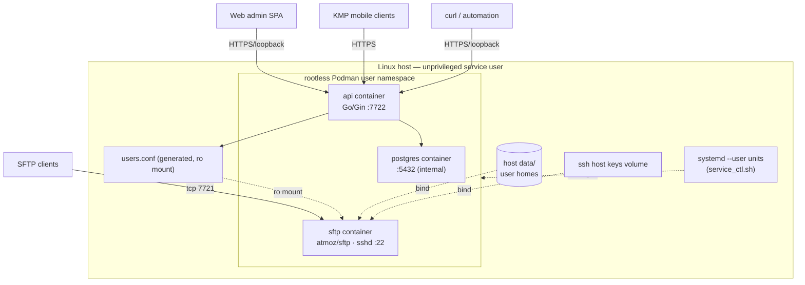

# Architecture Overview

**Revision:** 1
**Last modified:** 2026-07-11T15:23:48Z

Component map, data flows, security boundaries, and deployment topology of the enterprise SFTP management system. Design-level document: components cite their work items (ATM-xxx); only components with closed items have running evidence.

## Table of contents

1. [Component map](#1-component-map)
2. [Data flows](#2-data-flows)
3. [Security boundaries](#3-security-boundaries)
4. [Deployment topology](#4-deployment-topology)
5. [Diagrams](#5-diagrams)
6. [Related docs](#6-related-docs)

## 1. Component map

| Layer | Component | Tech | Item | State |
|---|---|---|---|---|
| Service | SFTP server | `atmoz/sftp` container, rootless Podman, host port 7721 → sshd :22 | ATM-001/003 | compose lands ATM-001; config render ATM-003 |
| Service | REST API | Go 1.26 + Gin, port 7722 | ATM-002 | not yet built |
| Data | Primary DB | SQLite (dev) / PostgreSQL 16 (prod), embedded migrations | ATM-002 | not yet built |
| Data | `users.conf` | generated artifact (atomic render from DB) | ATM-003 | not yet built |
| Data | User files | host `data/` tree, per-user homes + writable subdirs | ATM-003 | not yet built |
| Client | Web admin | Vite + React + TypeScript, OpenDesign tokens, i18n (en) | ATM-004 | not yet built |
| Client | Mobile | KMP + Compose Multiplatform (Android/iOS/HarmonyOS/AuroraOS) | ATM-005 | not yet built |
| Ops | Scripts + units | `setup.sh`, `service_ctl.sh`, `backup.sh`, `firebase_config.sh`, systemd `--user` | ATM-006 | not yet built |
| Ops | Observability | optional Firebase Analytics/Performance/Crashlytics (opt-in flags) | ATM-007 | not yet built |
| Quality | Test matrix | pre-build gates, integration, e2e, stress/chaos/perf/security, Challenges + HelixQA | ATM-009 | in progress |
| Quality | Docs Chain | `.docs_chain/contexts/` sync + export engine | ATM-010 | first contexts this revision |

Owned shared submodules consumed by the above (flat layout, §11.4.28): `auth` (JWT/middleware), `config`, `database`, `observability`, `ratelimiter`, `middleware`, `recovery`, `containers` (rootless orchestration), `security`, `storage`, `i18n`, `open_design`, `challenges`, `helixqa`, `docs_chain`.

## 2. Data flows

### 2.1 Account create → SFTP usable (the core flow)

```mermaid
sequenceDiagram
    participant Admin as Super-admin (Web/Mobile/curl)
    participant API as REST API (Gin)
    participant DB as SQLite/PostgreSQL
    participant R as users.conf renderer + provisioner
    participant C as SFTP container (atmoz/sftp)
    participant U as SFTP client (end user)

    Admin->>API: POST /api/v1/accounts {username, permission, public:false}
    API->>API: validate (schema, enum, public-guard, password policy)
    API->>DB: tx: insert account (Argon2id hash)
    DB-->>API: committed
    API->>R: render users.conf (write-temp-then-rename)
    R->>R: provision home: root-owned top + writable subdir
    API->>C: reload signal (containers submodule, rootless)
    C-->>API: reloaded
    API->>DB: audit row (actor, action, account, ts)
    API-->>Admin: 201 (no secret material)
    U->>C: sftp -P 7721 user@host
    C-->>U: chroot session; upload into writable subdir
```

Guarantees: DB is the single source of truth; `users.conf` is never half-written (atomic rename); the directory layout satisfies the OpenSSH chroot rule ([security guide §4](../guides/security_guide.md)); every mutation is audit-logged.

### 2.2 Login flow

Super-admin → `POST /api/v1/auth/login` → JWT (short-lived) → all `/api/v1/**` requests carry `Authorization: Bearer` → middleware chain: request-id → logging (redacted) → recovery → rate-limit → authn → handler.

### 2.3 Backup flow

`backup.sh` (ATM-006): stop-the-world-free snapshot — DB dump + `data/` + `users.conf` + `.env`-adjacent non-secret config → timestamped artifact → restore verifies checksums before swap-in.

## 3. Security boundaries

1. **Network → host:** only 7721 (SFTP) and 7722 (API, loopback-or-TLS) published.
2. **Host → container:** rootless user namespace; container root ≠ host root; no privileged containers; no host-socket mounts.
3. **Container → user files:** chroot `%h`, `ForceCommand internal-sftp`, no TTY/forwarding; top-level home non-writable.
4. **Client → API:** JWT + rate limiting + strict schema; public accounts forced `read_only` with explicit acknowledgement.
5. **Git → secrets:** nothing sensitive tracked (§11.4.10/§11.4.30); `.env.example` placeholders only.

## 4. Deployment topology

Single-host rootless compose (MVP target; the design does not preclude multi-host later):



SVG/PDF exports of these diagrams live under `docs/design/` (STREAM-8 / ATM-008 territory — this doc references, does not own, them).

## 5. Diagrams

- Sequence + topology diagrams: Mermaid sources inline above; rendered SVG boards: `docs/design/` (STREAM-8).
- Permissions state machine: [permissions_model.md](permissions_model.md).

## 6. Related docs

- [permissions_model.md](permissions_model.md)
- [../guides/deployment_guide.md](../guides/deployment_guide.md)
- [../guides/security_guide.md](../guides/security_guide.md)
- `docs/plans/master_implementation_plan.md` — stream-level build plan
- `docs/research/mvp/MVP.md` — baseline reference implementation

---

## Sources verified (2026-07-11)

- Internal: `docs/Issues.md` ATM-001..ATM-010 · `docs/plans/master_implementation_plan.md` · `docs/CONTINUATION.md` · `docs/research/mvp/MVP.md`.
- External fetched this revision (via the guides): `https://github.com/atmoz/sftp` · `https://github.com/containers/podman-compose` · `https://docs.podman.io/en/latest/`.
