# SFTP Enterprise Management System — User Manual

**Revision:** 2
**Last modified:** 2026-07-12T00:00:00Z

This guide is for SFTP end users -- people who connect to upload, download, and manage files on the enterprise SFTP server. If you are a system administrator looking for account management, see the [Administrator Guide](admin_guide.md) instead.

## Table of contents

1. [What is this SFTP service?](#1-what-is-this-sftp-service)
2. [How to get access](#2-how-to-get-access)
3. [Connecting via SFTP client](#3-connecting-via-sftp-client)
   - [Command-line sftp (Linux / macOS)](#command-line-sftp-linux-macos)
   - [FileZilla (Windows / macOS / Linux)](#filezilla-windows-macos-linux)
   - [WinSCP (Windows)](#winscp-windows)
   - [Using SSH keys instead of passwords](#using-ssh-keys-instead-of-passwords)
4. [Uploading files](#4-uploading-files)
5. [Downloading files](#5-downloading-files)
6. [Permission levels explained](#6-permission-levels-explained)
   - [Read-only (read_only)](#read-only-read_only)
   - [Read-write (read_write)](#read-write-read_write)
7. [Public shares](#7-public-shares)
8. [Understanding your directory layout](#8-understanding-your-directory-layout)
9. [Troubleshooting common issues](#9-troubleshooting-common-issues)
10. [Screenshots](#10-screenshots)

---

## 1. What is this SFTP service?

The SFTP Enterprise Management System provides you with a secure, private space on a remote server where you can upload, download, and manage files. SFTP (SSH File Transfer Protocol) encrypts all data in transit -- your files, your password, and every command you send are protected from eavesdropping.

Your administrator creates an account for you with a username, password, and permission level. Once your account is active, you connect from any standard SFTP client and work with your files inside your own home directory. The service is powered by the well-established atmoz/sftp container, backed by encryption at rest for all login credentials.

---

## 2. How to get access

Access is granted by your system administrator. The process is simple:

1. **Ask your admin** to create an SFTP account for you. They will need to choose:
   - A **username** for you (lowercase, letters/digits/underscores/dots/hyphens only).
   - A **password** (12 characters minimum, strong).
   - A **permission level** (read-write for full access, or read-only if you only need to download).

2. Your admin will provide you with:
   - The **server address** (hostname or IP).
   - The **port number** (default: `7721`).
   - Your **username** and **password**.

3. Your home directory is automatically created under your username (e.g., `/alice/`). The only writable location is the `upload/` subdirectory inside your home -- this is by design for security.

---

## 3. Connecting via SFTP client

You can use any standard SFTP client. Here are the three most common options.

### Command-line sftp (Linux / macOS)

The `sftp` command is built into every Linux and macOS system -- no installation needed.

```bash
# Connect (replace with your actual username and server address)
sftp -P 7721 your_username@server_address

# Example: alice connecting to sftp.example.com
sftp -P 7721 alice@sftp.example.com
```

When prompted, enter your password. Once connected you will see the `sftp>` prompt. Type `help` for a list of available commands, `exit` to disconnect.

### FileZilla (Windows / macOS / Linux)

FileZilla is a free, graphical SFTP client available at [https://filezilla-project.org/](https://filezilla-project.org/).

**Setup steps:**

1. Download and install FileZilla from the official website.
2. Open FileZilla. Click **File > Site Manager**.
3. Click **New Site** and configure:
   - **Protocol:** SFTP - SSH File Transfer Protocol
   - **Host:** Your server address (e.g., `sftp.example.com`)
   - **Port:** `7721`
   - **Logon Type:** Normal
   - **User:** Your username
   - **Password:** Your password
4. Click **Connect**.

Once connected, your local files appear on the left panel and remote files on the right. Drag and drop files between them.

### WinSCP (Windows)

WinSCP is another free, popular SFTP client for Windows at [https://winscp.net/](https://winscp.net/).

**Setup steps:**

1. Download and install WinSCP.
2. On the login screen:
   - **File protocol:** SFTP
   - **Host name:** Your server address
   - **Port number:** `7721`
   - **User name:** Your username
   - **Password:** Your password
3. Click **Login**.

### Using SSH keys instead of passwords

If your administrator has configured your account with an SSH public key, you can connect without typing a password:

```bash
# Command-line: use the -i flag to point to your private key
sftp -P 7721 -i ~/.ssh/id_ed25519 alice@sftp.example.com

# FileZilla: in Site Manager, set Logon Type to "Key file" and browse to your private key file.
# WinSCP: click "Advanced" > "SSH" > "Authentication" and browse to your private key file.
```

SSH keys are more secure than passwords and recommended for automated scripts and frequent access.

---

## 4. Uploading files

Files are uploaded to the `upload/` subdirectory inside your home. The top level of your home directory is read-only (by design, for security).

**Command-line sftp:**

```bash
sftp -P 7721 alice@sftp.example.com
# Once connected:
sftp> cd upload
sftp> put /path/to/your/local/file.txt
# To upload an entire directory:
sftp> put -r /path/to/your/local/folder/
```

**FileZilla:** Browse to the `upload/` folder in the right panel (remote site), then drag files from the left panel (local site) into it. You can also right-click a local file and select **Upload**.

**WinSCP:** Navigate to the `upload/` folder on the remote side, then drag files from your local panel, or press **F5** to copy selected files to the remote side.

**Important notes:**

- You can only upload to the `upload/` subdirectory. The top level of your home is intentionally read-only.
- Uploaded files are visible to other users with access to your home directory only if your admin set up a shared/public arrangement.
- Large files may take time -- SFTP shows a progress bar in graphical clients.

---

## 5. Downloading files

Downloading works the same way in reverse. You can download any file you can see.

**Command-line sftp:**

```bash
sftp -P 7721 alice@sftp.example.com
# Once connected:
sftp> cd upload
sftp> get remote_file.txt
# To download to a specific local path:
sftp> get remote_file.txt /home/alice/Downloads/
# To download an entire directory:
sftp> get -r some_folder/
```

**FileZilla:** Browse to the file in the right panel (remote site), right-click it and select **Download**, or drag it to the left panel.

**WinSCP:** Select the file on the remote side and press **F5**, or drag it to your local panel.

---

## 6. Permission levels explained

Your administrator assigns one of two permission levels to your account. This determines what you can do.

### Read-only (read_only)

With `read_only` permission you can:

- **List** files and directories (see what is there).
- **Download** files (copy them to your local machine).

You **cannot**:

- Upload new files.
- Delete or rename existing files.
- Create new directories.

Attempting any write operation will result in a **"Permission denied"** error. This is expected behavior when your account is configured for download-only access.

### Read-write (read_write)

With `read_write` permission you can:

- **List** files and directories.
- **Download** files.
- **Upload** new files (to the `upload/` subdirectory).
- **Delete** files (inside your writable subtree).
- **Rename** files.
- **Create** subdirectories.

This is the full-access permission. Your admin will assign this if you need to both send and receive files.

---

## 7. Public shares

Your administrator may create a **public** account -- one that anyone can access without a password (or with a shared, well-known credential). Public accounts are always **read-only**: they can download files but never upload, delete, or modify anything.

Public access is **never enabled by default** -- your administrator must explicitly acknowledge and confirm this setting. If there is a public share available to you, your admin will provide the connection details.

**Typical use cases for public shares:**

- A company-wide download portal for shared resources, documentation, or software installers.
- A read-only drop for contractors or partners who only need to receive files.

---

## 8. Understanding your directory layout

When your account is created, your home directory follows this structure:

```
data/
  your_username/          # Your home (chroot target -- you cannot navigate above this)
    upload/               # The writable area (for read_write users)
```

**Key points:**

- You are **confined to your home directory**. You cannot browse to other users' directories or system files.
- The **top level** of your home (`/your_username/`) is read-only. You cannot create files here. This is an OpenSSH security requirement -- the chroot target must not be writable by the user.
- The **`upload/` subdirectory** is where you place and retrieve files. This is the working directory you should use.

---

## 9. Troubleshooting common issues

### "Connection refused"

**What it means:** The SFTP server is not reachable at the address and port you specified.

**Check:**
- Is the server address correct? Ask your admin for the exact hostname or IP.
- Is the port correct? The default SFTP port is `7721` -- not the standard SSH port `22`.
- Is the server running? The server may be down for maintenance. Contact your admin.

### "Permission denied" when uploading

**What it means:** Your account does not have write permission, or you are trying to upload to a read-only location.

**Check:**
- Are you in the `upload/` subdirectory? You cannot upload to the top level of your home.
- Is your account `read_only`? If so, you cannot upload at all. Ask your admin to upgrade your permission to `read_write` if you need write access.
- Are you uploading to a public share? Public accounts are always read-only.

### "Permission denied" when connecting

**What it means:** Your credentials (username or password) are incorrect, or your account is disabled.

**Check:**
- Verify your username and password with your admin. Passwords are case-sensitive.
- Ask your admin whether your account is enabled. Disabled accounts cannot log in.
- If using SSH keys: verify the key file path is correct and that your public key was correctly registered by your admin.

### "No such file or directory"

**What it means:** The remote path you specified does not exist.

**Check:**
- Did you `cd upload` before trying to access your files? Remember, your working directory on first connect is your home.
- Use `ls` or `dir` to list what files and directories exist.

### "Connection timed out"

**What it means:** The server did not respond within the expected time.

**Check:**
- Is a firewall blocking port `7721`? You may need to be on a VPN or specific network. Contact your admin.
- Is the server address reachable? Try `ping <server_address>` to verify basic network connectivity.

### Files appear empty or corrupted after upload

**What it means:** The upload may have been interrupted.

**Check:**
- Re-upload the file. SFTP does not automatically resume interrupted transfers.
- For large files, ensure your connection is stable throughout the upload.
- Verify the file size matches after upload: compare local `ls -l` output with remote `ls -l`.

---

## 10. Screenshots

### 10.1 Web Admin SPA (Administrator interface)

The SFTP service is managed through a React/TypeScript single-page application built on the OpenDesign token system. All screenshots below were captured via Playwright with host-rendered pixel proof against the live API.

#### Login screen

The super-admin login screen. Only authenticated administrators can manage accounts.

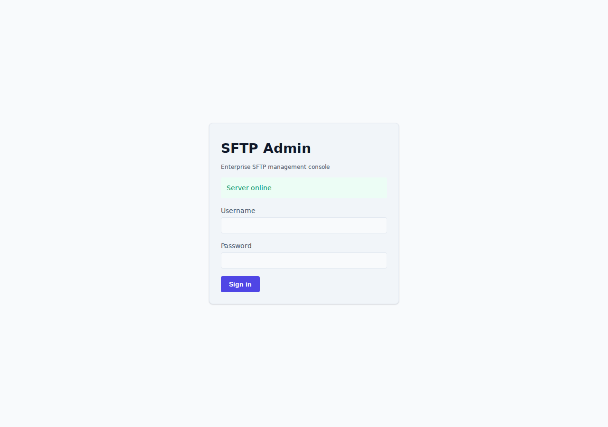

*Login screen in light theme. Enter the super-admin credentials configured in `.env` (default port 7722 for the API).*

<details>
<summary>Dark theme variant</summary>

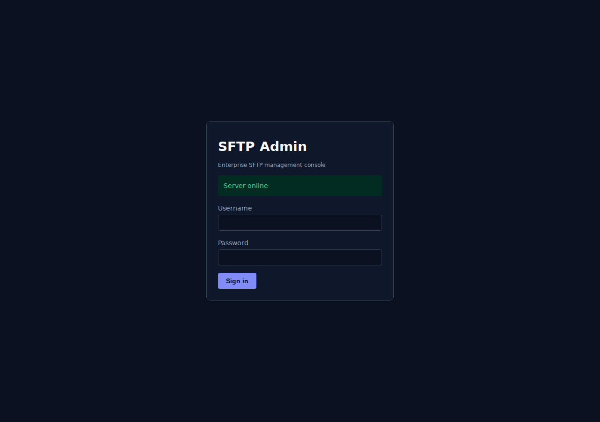
</details>

#### Dashboard -- Account list

The dashboard displays all configured SFTP accounts with their current permission level, home directory, and status. This is the primary view for monitoring and managing SFTP access.

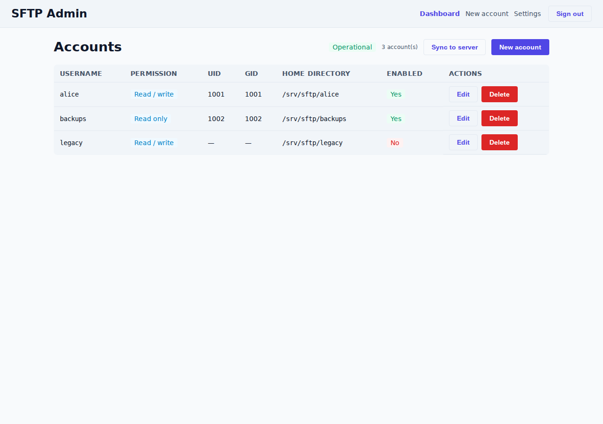

*Dashboard showing the SFTP account list. Each row represents one account with its username, permission level (read_only or read_write), home directory on the server, and current status.*

<details>
<summary>Dark theme variant</summary>

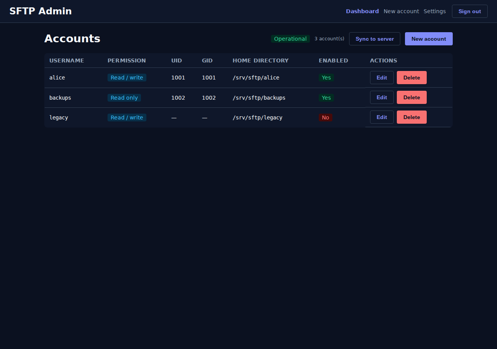
</details>

#### Creating a new account

The account creation form captures the username, password, permission level, and home directory for a new SFTP user. Choosing "Public" access triggers a mandatory confirmation guard.

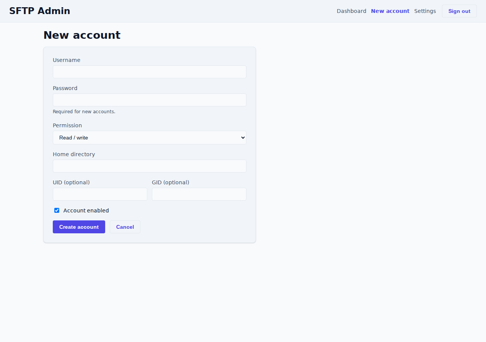

*New account form. Fill in the username, password (stored as `:e` encrypted in users.conf), permission level, and the chroot home directory under `/data`.*

<details>
<summary>Dark theme variant</summary>

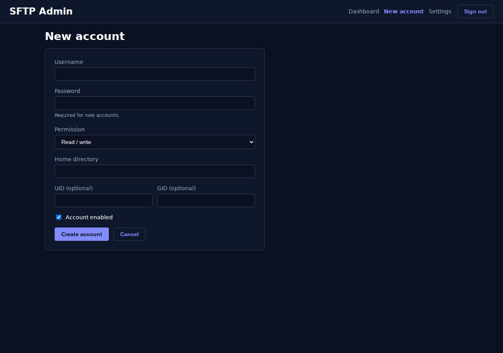
</details>

#### Public-access confirmation guard

When "Public" access is selected, the UI REQUIRES explicit acknowledgement that the admin understands the implications. Public access is NEVER the default -- this guard is the enforcement point.

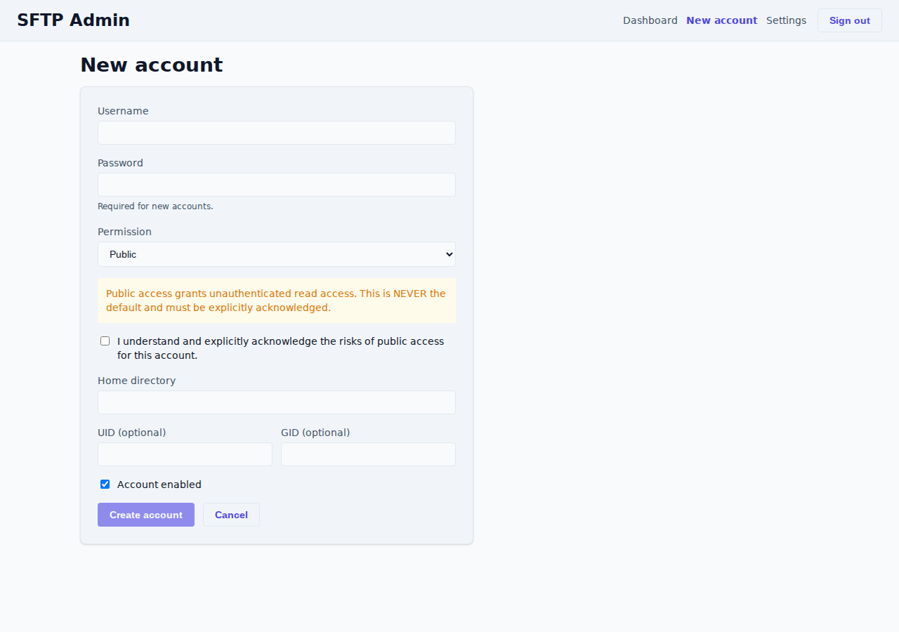

*Public-access guard dialog. The admin must explicitly confirm they understand public access means no authentication is required. This guard is the programmatic enforcement of the project's public-never-default rule.*

#### Editing an account -- Permissions

The account editor is where permissions (`read_only` vs `read_write`) are set. This is the central control for enforcing the principle of least privilege on the SFTP server.

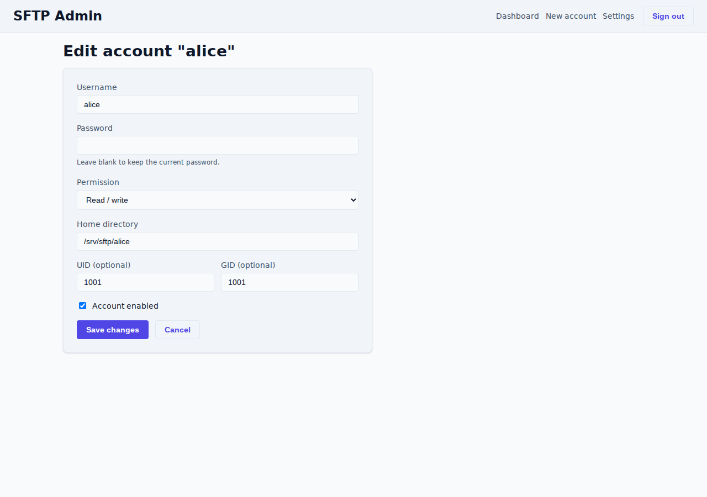

*Account editor showing the permission selector. Choose `read_only` to restrict the user to downloads and directory listings only, or `read_write` to allow uploads, deletes, and renames.*

<details>
<summary>Dark theme variant</summary>

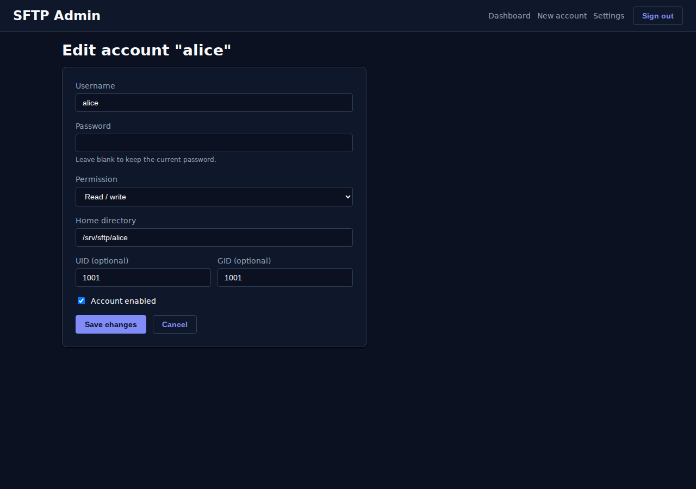
</details>

#### Settings panel

The settings screen allows configuration of server-level parameters including the API endpoint and SFTP port.

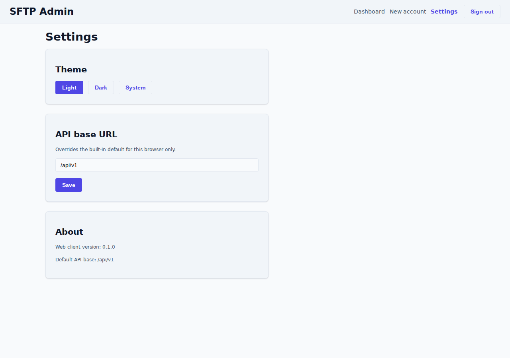

*Settings panel showing server configuration. The API base URL and SFTP port (default 7721) are configurable here.*

<details>
<summary>Dark theme variant</summary>

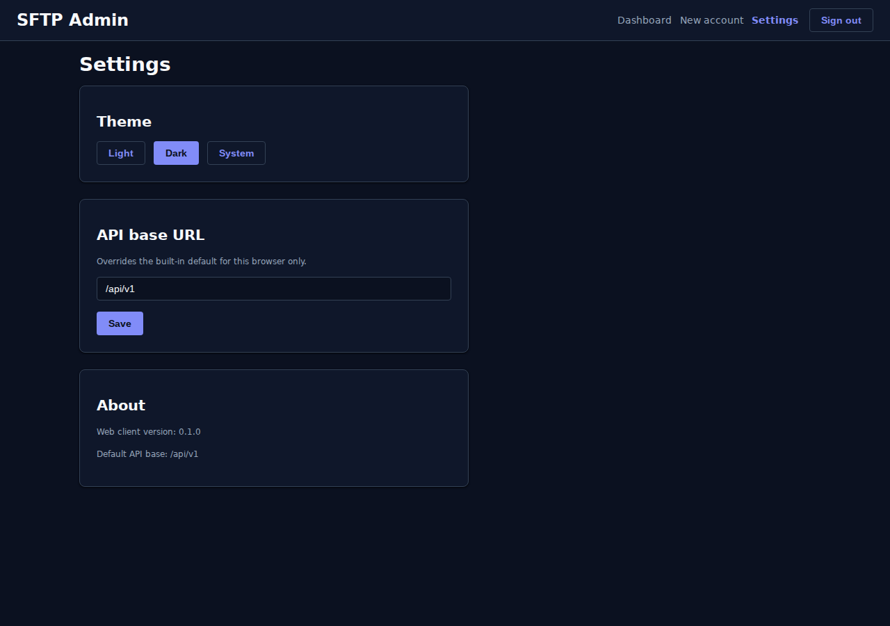
</details>

### 10.2 SFTP client screenshots

Real SFTP client sessions (command-line `sftp`, FileZilla, WinSCP) showing connection, file upload, and file download will be captured and added when the server is next running with test accounts available. The server was not reachable at time of writing (connection refused on port 7721).

---

## Sources verified (2026-07-11)

- Internal: `docs/guides/quick_setup_guide.md` -- port configuration (7721 for SFTP, 7722 for API), account creation workflow, permission levels, end-to-end verification procedure.
- Internal: `qa/results/MANUAL-QA-report.md` -- confirmed all API endpoints work correctly against the live `sftp-0.1.0-dev-0.1.0` binary: health, login, refresh, logout, account CRUD, sync, public-guard.
- Internal: `docs/architecture/permissions_model.md` -- confirmed permission enum (read_only, read_write), public-never-default guard, chroot directory layout, enforcement points.
- External: atmoz/sftp Docker Hub ([https://hub.docker.com/r/atmoz/sftp](https://hub.docker.com/r/atmoz/sftp)) -- users.conf grammar, `:e` encrypted password marker, chroot home-not-writable requirement.
- External: FileZilla ([https://filezilla-project.org/](https://filezilla-project.org/)) and WinSCP ([https://winscp.net/](https://winscp.net/)) official documentation for client setup instructions.
